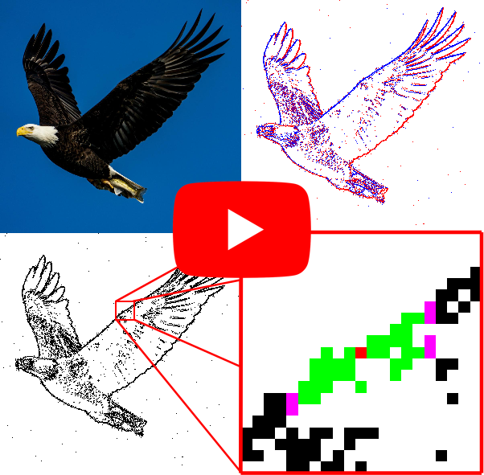

# Event-based Asynchronous Sparse Convolutional Networks
<p align="center">
  <a href="https://youtu.be/VD7Beh_-7eU">
    
  </a>
</p>

This is the code for the paper **Event-based Asynchronous Sparse Convolutional Networks** 
([PDF](http://rpg.ifi.uzh.ch/docs/ECCV20_Messikommer.pdf)) by Nico Messikommer*, [Daniel Gehrig*](https://danielgehrig18.github.io), 
[Antonio Loquercio](https://antonilo.github.io/), and [Davide Scaramuzza](http://rpg.ifi.uzh.ch/people_scaramuzza.html).

If you use any of this code, please cite the following publication:

```bibtex
@InProceedings{Messikommer20eccv,
  author        = {Nico Messikommer and Daniel Gehrig and Antonio Loquercio and Davide Scaramuzza},
  title         = {Event-based Asynchronous Sparse Convolutional Networks},
  journal       = {European Conference on Computer Vision. (ECCV)},
  url           = {http://rpg.ifi.uzh.ch/docs/ECCV20_Messikommer.pdf},
  year          = 2020
}
```

## Installation
First set up an [Anaconda](https://www.anaconda.com/) environment:

    conda create -n asynet python=3.7  
    conda activate asynet

Then clone the repository and install the dependencies with pip

    git clone git@github.com:uzh-rpg/rpg_asynet.git
    cd rpg_asynet/
    pip install -r requirements.txt

In addition `sparseconvnet 0.2` needs to be installed from [here](https://github.com/facebookresearch/SparseConvNet).

### CPP Bindings
To build the cpp bindings for the event representation tool, you can follow the instructions below:

    pip install event_representation_tool/

For the bindings for asynchronous sparse convolutions, we first need to clone the 3.4.0-rc version of [Eigen](http://eigen.tuxfamily.org/index.php?title=Main_Page) into the `include` folder. In addition, pybind11 is required.

    cd async_sparse_py/include
    git clone https://gitlab.com/libeigen/eigen.git --branch 3.4.0-rc1
    conda install -c conda-forge pybind11
  
Finally, the bindings can be installed

    pip install async_sparse_py/

## Sparse CNN Training
The training parameters can be adjusted in the `config/settings.yaml` file. 
The following training tasks and datasets are supported:
* Classification on NCars and NCaltech101.  
* Object Detection on Prophesee Gen1 Automotive and NCaltech101

Download location of the datasets:
* [Classification NCaltech101](http://rpg.ifi.uzh.ch/datasets/gehrig_et_al_iccv19/N-Caltech101.zip) 
* [NCars](http://www.prophesee.ai/dataset-n-cars/)
* [Object Detection NCaltech101](https://www.garrickorchard.com/datasets/n-caltech101)
* [Prophesee Gen1 Automotive](https://www.prophesee.ai/2020/01/24/prophesee-gen1-automotive-detection-dataset/):

To test the code, make a directory `data/` in the root of the repository and download one of the datasets:

    mkdir data
    cd data
    wget http://rpg.ifi.uzh.ch/datasets/gehrig_et_al_iccv19/N-Caltech101.zip
    unzip N-Caltech101.zip
    rm N-Caltech101.zip

The dataset can be configured in the `dataset/name` tag in `config/settings.yaml`. Different model types can be chosen based on the task and whether or not sparse convolutions should be used. 

* Sparse VGG for Classification and Object Detection
* Standard VGG for Classification and Object Detection

These can be configured in the `model` tag in `config/settings.yaml`.

The following command starts the training: 

```bash
CUDA_VISIBLE_DEVICES=<GPU_ID>, python train.py --settings_file config/settings.yaml
```

By default, a folder with the current date and time is created in `log/` containing the corresponding tensorboard files.


## Unit Tests
To test the different asynchronous and sparse layers, multiple unit tests are implemented in `unittests/`:
* Asynchronous Sparse Convolution Layer 2D: `sparse_conv2D_test.py`
* Asynchronous Sparse Convolution Layer 2D CPP Implementation: `sparse_conv2D_cpp_test.py`
* Asynchronous Sparse Max Pooling Layer: `sparse_max_pooling_test.py`
* Asynchronous Sparse VGG: `sparse_VGG_test.py`. <br/>
  There are three paths in the script `sparse_VGG_test.py` specified with `'PATH_TO_MODEL'` and `'PATH_TO_DATA'`, 
  which need to be replaced with the NCaltech Classification dataset and the sparse classification model trained on N-Caltech.

To run the unittests call

    python -m unittest discover -s unittests/ -p '*_test.py'

## Evaluation
There is one script in the `evaluation/sliding_window_flops.py` folder for computing the number of FLOPs.
The command to execute the script is:

    python -m evaluation.sliding_window_flops --setting config/settings.yaml
        --save_dir <PATH_TO_DIR> --num_events 1 --num_samples 500
        --representation histogram  --use_multiprocessing

The output of the script are the numbers of FLOPs for the four processing modes (Asyn Sparse Conv, Asyn Conv, Sparse Conv, Standard Conv).
